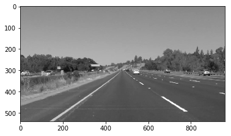
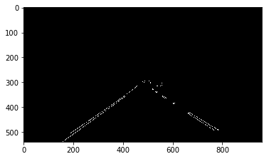
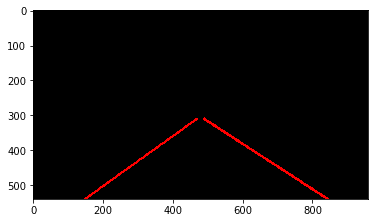
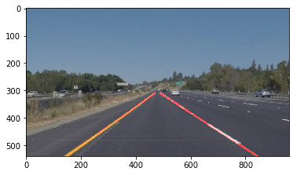

# **Finding Lane Lines on the Road** 

## Overview

When we drive, we use our eyes to decide where to go.  The lines on the road that show us where the lanes are act as our constant reference for where to steer the vehicle.  Naturally, one of the first things we would like to do in developing a self-driving car is to automatically detect lane lines using an algorithm.

In this project I will detect lane lines in images using Python and OpenCV.  OpenCV means "Open-Source Computer Vision", which is a package that has many useful tools for analyzing images. 

This project is the first project of the Udacity Self-Driving Car Engineer Nanodegree Program.

## Result

Here is a short video to show my result

## The goals / steps of this project:
1. Make a pipeline that finds lane lines on the road
2. Reflect on my work in a written report

## Reflection
### 1. Pipeline description

My pipeline consists of 6 steps.

First, I convert the images to grayscale:

Second, I apply Gaussian smoothing with a kernel size = 3:

Third, I define parameters for Canny and apply them to the images:

Then, I define a four sided polygon and create a masked edges:

Next, I define the Hough transform parameters and run Hough Transform on edge detected images:

Finally, I combine these lines into original images to get the final image:

In order to draw a single line on the left the right lanes, I modify the draw_lines() function by following step:

1. I calculate the slope and intersect of each line
2. I sort the lines whether it is the left line or the right line
3. I calculate the mean value of slope and intersect
4. I define the starting and ending point of each line and drew the lines on lanes

### 2. Potential shortcoming with my current pipeline

One potential shortcoming would be, if there are cars driving on the same lane as me and not so far in front of me, it may be a problem that the cars could be detected as part of lane lines.

Another shortcoming could be, if the camera is not on a fixed position on the car, it would be difficult to define Region of Interest.

### 3. Suggest possible improvement to my pipeline

A possible improvement would be using deep learning method to detect lane lines.